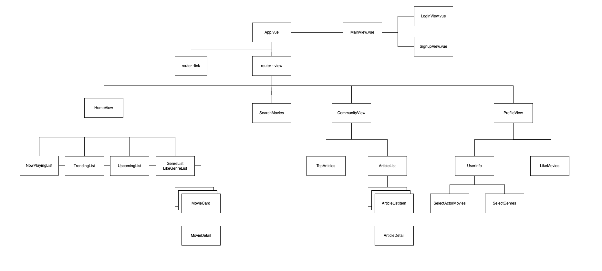
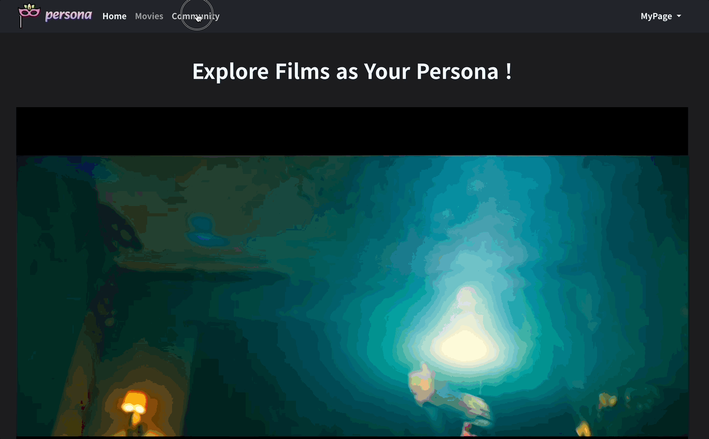
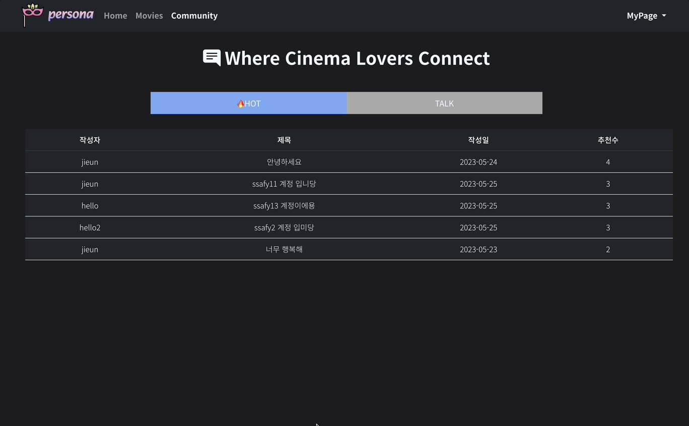

# Persona

# 프로젝트 소개
- 영화 추천 알고리즘 기반 커뮤니티 서비스
  - 좋아하는 배우 및 장르 기반 영화 추천
  - 영화 리뷰 및 평점, 게시글 작성 및 댓글 기능을 통한 사용자 간 소통 커뮤니티
- 프로젝트 기간
  - 2023.05.17 ~ 2023.05.25 (총 8일)
## 기술 스택
- Backend

 

- Fontend

  

- 그 외 (협업 도구)

## 팀원 구성 및 역할 분담
- 문지은
  - ERD 및 컴포넌트 설계
  - 영화 데이터 관련 BE & FE 구현
  - 영화 추천 알고리즘 구현
  - Vuex 데이터 관리
  - 프로필 관련 FE 구현
  - 레퍼런스 수집
- 최지수
  - ERD 및 컴포넌트 설계
  - 기본 백엔드 베이스 구성
  - account 관련 BE 구현
  - 게시판 관련 BE & FE 구현
  - 컨셉 디자인 및 CSS 정의
  - 페이지 레이아웃 설계 

# 프로젝트 구조
## 데이터베이스 모델링 (ERD)

## 백엔드 구성
### articles
- `articles/` : 게시글 전체 확인 및 게시글 생성 (GET, POST)
- `articles/<int:article_pk>/ `: 게시글 상세 확인 및 삭제, 수정 (GET, PUT, DELETE)
- `articles/<int:article_pk>/like/` : 게시글 좋아요 및 좋아요 취소 (POST)
- `articles/<int:article_pk>/comments/` : 특정 게시글에 대한 댓글 생성 및 댓글 리스트 확인 (GET, POST)
- `comments/<int:comment_pk>/` : 댓글 삭제 (DELETE)
- `articles/top/` : 인기 게시글 확인 (GET)
### movies
- `movies/<int:movie_pk>/` : 영화 데이터 생성 (POST)
- `movies/<int:movie_pk>/like/` : 보고 싶은 영화 담기 및 담기 취소 (POST)
- `movies/<int:movie_pk>/reviews/` : 특정 영화에 대한 리뷰 생성 및 리뷰 리스트 확인 (GET, POST)
- `<int:movie_pk>/reviews/<int:review_pk>/` : 특정 영화에 대한 리뷰 삭제 (DELETE)
### accounts
- `accounts/signup/` : 회원가입 기능 (POST)
- `accounts/login/` : 로그인 기능 (POST)
- `profile/<username>/` : 특정 유저의 프로필 확인 (GET)
- `upload_image/<username>/` : 특정 유저의 프로필 이미지 등록 및 확인 (GET, PUT)
- `genres/<username>/` : 특정 유저의 선호하는 장르 등록 및 확인 (GET, POST)

## 컴포넌트 구조

# 영화 추천 알고리즘
## 장르 기반 추천
- 비회원 & 회원가입 후 좋아하는 장르를 선택하지 않은 회원
  - TMDB에서 제공하는 영화 장르 17개 중 랜덤으로 3개를 추출하여 각 장르별 popularity 기준으로 20개씩 영화 추천
- 좋아하는 장르를 선택한 회원
  - 회원이 선택한 장르들 중에서 랜덤으로 3개를 추출하여 각 장르별 popularity 기준으로 20개씩 영화 추천
## 배우 기반 추천
- 영화 상세 정보 페이지에 각 영화의 주연배우 6명이 출력되고, 회원은 배우 중 한명을 자신의 부캐로 지정할 수 있음
- 부캐를 설정하고 나면 프로필에서 해당 영화배우가 출연한 영화를 추천
- 영화 리뷰 및 커뮤니티를 통해 다른 회원의 프로필로 접속하고, 다른 회원의 캐릭터가 나온 영화도 확인 가능
# 주요 기능
## 초기화면 - 회원가입, 로그인

- 회원가입을 할 수 있는 페이지가 첫 화면
- 회원가입을 완료하면 알림창이 뜸
- 회원가입을 하면 로그인 창으로 갈 수 있는 버튼을 클릭하여 바로 로그인이 가능함
- 로그인을 하면 메인페이지로 이동
- 비회원으로 이용도 가능

## 홈 화면

- 네비게이션 바의 항목을 이용해 다른 페이지로 이동 가능
- 화면 첫 렌더링시에는 트렌딩 일별 1위 영상을 보여줌
- 영화 포스터에 마우스를 올리면 그 영화에 해당하는 영상을 보여줌
- 기본적으로 일별/주별 트렌딩 영화, 현재 상영중인 영화, 개봉 예정 영화를 보여줌
- 비회원인 경우 랜덤 장르 3개를 선정해 장르에 해당하는 영화를 보여줌

## 영화 디테일 페이지

- 포스터를 클릭하면 영화 정보가 나옴
- 마우스를 올리면 포스터 위에 영화 평점이 나옴
- 영화 출연진을 보여주고 원하는 배우를 클릭하면 프로필 사진으로 등록 가능
- 별을 클릭하여 원하는 평점을 남기면 모든 사람들의 평점을 반영하여 보여주고 한줄평도 남길 수 있음
- 자신이 남긴 한줄평만 삭제 할 수 있고 남이 남긴 한줄평은 삭제 불가능
- 좋아요를 누르면 몇 명이 좋아요를 눌렀는지 알 수 있음
- 예고편 버튼을 클릭하여 예고편을 볼 수 있는 링크로 넘어감

## 프로필 페이지

- 네비게이션 바에 있는 Mypage를 클릭하면 아이디와 프로필 사진과 선호 장르가 나옴
- 나의 프로필 보기를 클릭하면 자신이 선택한 나의 부캐 사진과 그 부캐에 대한 정보가 나옴
- 부캐 랜덤 추천 받기를 통해 원하는 부캐를 선택 가능
- 좋아하는 장르를 최소 3가지 이상을 선택하면 자신이 선택한 장르에 대한 영화를 추천해주어 메인페이지에 보여줌
- 좋아요를 누른 영화가 담겨 나의 프로필에서 볼 수 있음

## 검색 기능

- 네비게이션 바에 있는 Movies를 클릭하면 검색창이 나옴
- 검색해서 나온 영화 포스터를 클릭하면 영화 상세 정보를 보여줌

## 커뮤니티

- 테이블 형식으로 보여줌
- 작성한 모든 글을 볼 수 있는 TALK 페이지와 좋아요가 가장 많은 게시글 5개를 뽑아 HOT에 보여줌
- HOT 게시판에 해당 글의 좋아요 수를 보여줌
- 제목을 클릭하면 해당 글의 디테일 페이지로 넘어가 좋아요와 댓글을 남길 수 있음
- 아이디를 클릭하면 해당 글을 작성한 회원의 프로필을 볼 수 있음
- 글을 작성한 회원인 경우에만 수정 삭제 버튼이 나타남
- 댓글을 작성한 회원인 경우에만 삭제 버튼이
- 한 페이지에 글이 10개가 넘어가면 다음 페이지로 넘어갈 수 있는 페이지네이션을 사용함

# 시행착오 및 느낀점
## 문지은
- 초기 데이터 모델링을 할 때 필드명 작성이 매우 중요하다는 것을 알게 되었다. 한번 migrate를 하고 나면 수정도 어렵고, 잘못 작성하면 나 뿐만 아니라 페어도 혼란스럽게 할 수 있기 때문에 신중히 결정해야겠다고 느꼈다.
- 필요한 데이터 모델을 정의하고 시리얼라이저를 통해 직렬화 하는 방법과, API를 통해 데이터를 전송하고 요청하는 방법에 대해 익혔다.
- 깃허브를 통해 협업하면서 페어와의 소통의 중요성도 알게 되었다.
- 또한 프로젝트의 진행 과정과 시행 착오와 오류 해결에 대한 기록이 꼭 필요하다는 것도 알게 되었다.
## 최지수
- 처음에는 css에 어려움을 느꼈는데 하다보니 어떻게 되는지 조금씩 이해가 가기 시작했다. 수업만 들었을 때는 내용들이 크게 와닿지 않았는데 확실히 프로젝트를 하면서 직접 사용해 보면서 이해가 되고 와닿기 시작했다.
- 오류가 생길 때 차근차근 처음부터 다시 해보면서 찾으려고 하였고 함수가 어떻게 실행되는지 흐름을 이해하면서 오류를 찾으려고 노력하였다.
- 프로젝트에서 협업의 중요성을 다시 한 번 크게 느끼게 되었다. 나만 잘한다고 해서 되는 것이 아닌 페어와 함께 호흡을 맞추어 해 나가는 것이 프로젝트의 완성을 만들어 준다는 것을 느끼게 해준 기간이였다. 
- 혼자서는 절대 못 찾을 오류도 페어와 함께 찾으니 훨씬 더 빠르게 찾을 수 있었던 것 같다. 막막했던 프로젝트가 같이 완성해 가니 욕심이 생겨 더 잘하고 싶다는 생각을 많이 했다. 시간이 조금만 더 있었으면 더 잘할 수 있었을텐데 라는 생각이 계속 들게 만들었던 프로젝트였다. 그래도 완성된 프로젝트를 보고 뿌듯함을 느꼈다.