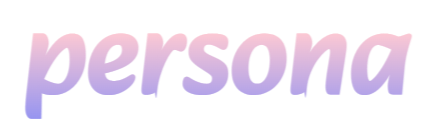
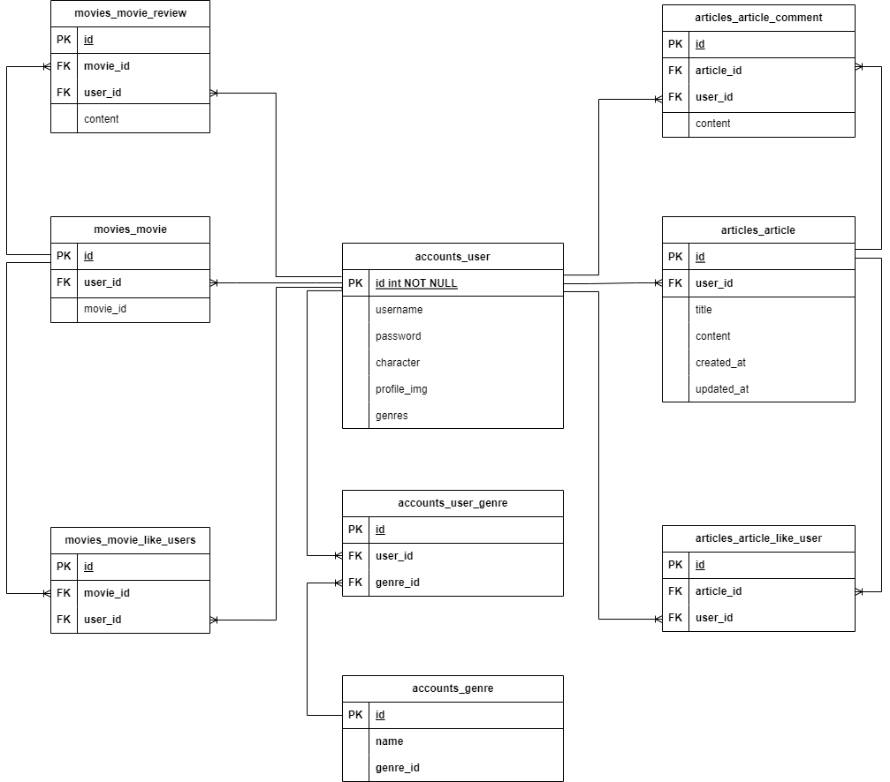

# Persona

# 프로젝트 소개
- 영화 추천 알고리즘 기반 커뮤니티 서비스
  - 좋아하는 장르 및 좋아하는 장르 기반 영화 추천 알고리즘
  - 영화 리뷰 및 평점, 게시글 작성 및 댓글 기능을 통한 사용자 간 소통 커뮤니티
- 프로젝트 기간
  - 2023.05.17 ~ 2023.05.25 (총 8일)
## 기술 스택
- Backend

 

- Fontend

 
 

- 그 외 (협업 도구)

## 팀원 구성 및 역할 분담
- 문지은
- 최지수

# 프로젝트 구조
- 데이터베이스 모델링 (ERD)

- 컴포넌트 구조

# 주요 기능